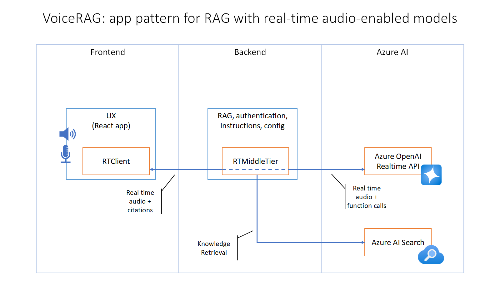

# Edu Echo: Where Questions Spark Conversations, and Learning Comes Alive

## Overview
Edu Echo is a voice-first education platform designed to help 4th, 5th, and 6th grade students excel in math and language arts. Using Azure OpenAI GPT-4o Realtime, it combines natural conversational interfaces with powerful Retrieval-Augmented Generation (RAG) to deliver personalized, step-by-step explanations and answers to academic queries.

Students can ask questions like:

- "How do I multiply multi-digit numbers?"
- "Can you help me understand verb tenses in my 4th grade language arts class?"
- "Please explain context clues in my 5th grade language arts class."

## Features
- **Interactive Voice Tutoring**: Engage in natural, conversational learning with voice inputs and outputs.
- **Step-by-Step Problem Solving**: Break down complex topics into manageable explanations.
- **Personalized Learning**: Adapt explanations to the student's grade level and subject proficiency.
- **Real-Time Citations**: Show references and sources for all responses to ensure credibility.
- **Focused Subject Support**: Currently tailored for math and language arts for 4th, 5th, and 6th grades.
- **RAG (Retrieval Augmented Generation)**: The app uses the Azure AI Search service to answer questions about a knowledge base, and sends the retrieved documents to the GPT-4o Realtime API to generate a response.

## Architecture
The application leverages the following Azure services:

- **Azure OpenAI GPT-4o Realtime API**: Processes voice input and generates conversational responses.
- **Azure OpenAI Text Embedding API**: Generates embeddings for the indexed documents.
- **Azure AI Search**: Retrieves relevant educational content from indexed academic resources. Uses semantic ranking to return the most relevant documents.
- **Azure Storage**: Stores indexed BLOB storage documents for retrieval.



## Getting Started

### Prerequisites

Ensure you have the following installed:

- [Azure Developer CLI](https://aka.ms/azure-dev/install)
- [Node.js](https://nodejs.org/)
- [Python >=3.11](https://www.python.org/downloads/)
  - **Important**: Python and pip must be in the system PATH.
- [Git](https://git-scm.com/downloads)
- [Powershell](https://learn.microsoft.com/powershell/scripting/install/installing-powershell) (Windows users only)

### Setup Instructions

1. Clone the repository:

    ```bash
    git clone https://github.com/khareesmith/EduEcho.git
    ```

2. Navigate to the project directory:

    ```bash
    cd EduEcho
    ```

3. Create a new Azure Developer CLI environment:

    ```bash
    azd env new
    ```

4. Deploy the app:

    ```bash
    azd up
    ```

   - **Note**: This command provisions the necessary Azure resources and deploys the app.

5. After deployment, navigate to the provided URL to access the application.

6. To run locally, configure `app/backend/.env` with the required environment variables (detailed below) and start the app:

   ```bash
   ./scripts/start.sh
   ```

### Environment Variables

Create a `.env` file with the following:

```env
   AZURE_OPENAI_ENDPOINT=wss://<your instance name>.openai.azure.com
   AZURE_OPENAI_REALTIME_DEPLOYMENT=gpt-4o-realtime-preview
   AZURE_OPENAI_REALTIME_VOICE_CHOICE=<choose one: echo, alloy, shimmer>
   AZURE_OPENAI_API_KEY=<your api key>
   AZURE_SEARCH_ENDPOINT=https://<your service name>.search.windows.net
   AZURE_SEARCH_INDEX=<your index name>
   AZURE_SEARCH_API_KEY=<your api key>
   AZURE_SEARCH_SEMANTIC_CONFIGURATION=default
   AZURE_SEARCH_IDENTIFIER_FIELD=chunk_id
   AZURE_SEARCH_CONTENT_FIELD=chunk
   AZURE_SEARCH_TITLE_FIELD=title
   AZURE_SEARCH_EMBEDDING_FIELD=text_vector
```

## Development Server

Run the application locally for development using the setup provided in the `scripts` folder.

- **Start script (Linux/Mac):**
  ```bash
  ./scripts/start.sh
  ```
- **Start script (Windows):**
  ```pwsh
  .\scripts\start.ps1
  ```

  OR

  ```pwsh
  powershell.exe .\scripts\start.ps1
  ```

Access the app at [http://localhost:8765](http://localhost:8765)

Once the app is running, when you navigate to the URL above you should see the start screen of the app:
   

Click the "Start conversation button", say "Hello", and then ask a question about the documents in the `data` folder.

## Guidance

### Costs

Pricing varies per region and usage, so it isn't possible to predict exact costs for your usage.
However, you can try the [Azure pricing calculator](https://azure.com/e/a87a169b256e43c089015fda8182ca87) for the resources below.

* Azure Container Apps: Consumption plan with 1 CPU core, 2.0 GB RAM. Pricing with Pay-as-You-Go. [Pricing](https://azure.microsoft.com/pricing/details/container-apps/)
* Azure OpenAI: Standard tier, gpt-4o-realtime and text-embedding-3-large models. Pricing per 1K tokens used. [Pricing](https://azure.microsoft.com/pricing/details/cognitive-services/openai-service/)
* Azure AI Search: Standard tier, 1 replica, free level of semantic search. Pricing per hour. [Pricing](https://azure.microsoft.com/pricing/details/search/)
* Azure Blob Storage: Standard tier with ZRS (Zone-redundant storage). Pricing per storage and read operations. [Pricing](https://azure.microsoft.com/pricing/details/storage/blobs/)
* Azure Monitor: Pay-as-you-go tier. Costs based on data ingested. [Pricing](https://azure.microsoft.com/pricing/details/monitor/)

To reduce costs, you can switch to free SKUs for various services, but those SKUs have limitations.

⚠️ To avoid unnecessary costs, remember to take down your app if it's no longer in use by deleting the resource group in the Portal.

### Security

This application uses [Managed Identity](https://learn.microsoft.com/entra/identity/managed-identities-azure-resources/overview) to eliminate the need for developers to manage the credentials. To ensure best practices, it is recommended that anyone creating solutions based on this application ensure that the [Github secret scanning](https://docs.github.com/code-security/secret-scanning/about-secret-scanning) setting is enabled for your repo.

### Notes

>Sample data: The PDF documents used in this demo contain information generated using a language model (OpenAI's GPT-4o). The information contained in these documents is only for demonstration purposes and does not reflect the opinions or beliefs of the creators of this application. We make no representations or warranties of any kind, express or implied, about the completeness, accuracy, reliability, suitability or availability with respect to the information contained in this document. All rights reserved.

## Resources

- [VoiceRAG GitHub Sample](https://github.com/Azure-Samples/aisearch-openai-rag-audio)
- [Blog post: VoiceRAG](https://aka.ms/voicerag)
- [Demo video: VoiceRAG](https://youtu.be/vXJka8xZ9Ko)
- [Azure OpenAI Realtime Documentation](https://github.com/Azure-Samples/aoai-realtime-audio-sdk/)
- [Manual setup guide](docs/manual_setup.md)
- [Existing Services](docs/existing_services.md)
- [Customizing Deployment](docs/customizing_deploy.md)
